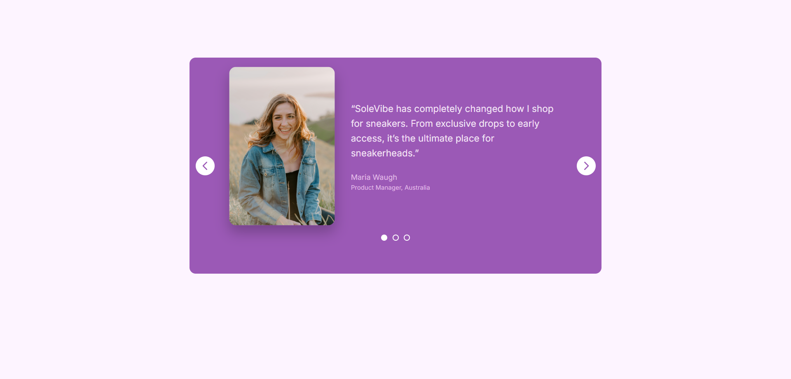

# 🎠 Responsive Testimonial Carousel

A sleek and responsive **testimonial carousel** built using HTML, CSS, and JavaScript.  
Showcases user feedback with smooth slide animations, dot navigation, and arrow controls — perfect for product or service websites.

---

## 🎨 Features

- 📸 Rotating testimonials with smooth transitions
- ➡️ Left and right arrow controls
- 🟣 Dot indicators for manual navigation
- 💬 Clean layout with responsive design
- 🧩 Built with semantic HTML, styled with CSS, and powered by JavaScript

---

## 🛠️ Built With

| Technology    | Purpose                |
| ------------- | ---------------------- |
| 🧱 HTML5      | Structure              |
| 🎨 CSS3       | Styling & Layout       |
| ⚙️ JavaScript | Carousel Functionality |

---

## 📸 Screenshot

## 🌐 Live Demo

🔗 **View it on GitHub Pages:**

---

## 📧 Connect with Me 🎠

🔗 **LinkedIn:**  
https://www.linkedin.com/in/gaurav-lad1974

📨 **Email:**  
gauravlad1974@gmail.com
